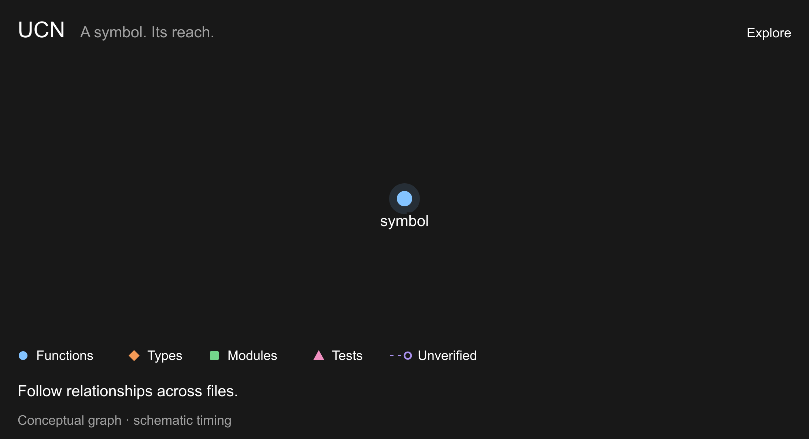

# UCN - Universal Code Navigator

See what code does before you touch it.

[](https://www.npmjs.com/package/ucn)
[](https://github.com/mleoca/ucn/actions/workflows/ci.yml)
[](LICENSE)

If you work with AI Agents, add UCN as a [Skill or MCP tool](#ai-setup). One tool
gives the agent compact, source-linked answers to caller, impact, and test
questions, with uncertainty labeled instead of guessed.



Conceptual overview · [Still image](assets/readme/ucn-connected-scope.png)

Use the CLI directly, install the [agent skill](#agent-skill-no-server-needed),
or connect through [MCP](#mcp). One engine supplies all three:

```text
  Terminal              AI Agents           Agent Skills
       │                    │                    │
      CLI                  MCP                 Skill
       └────────────────────┼────────────────────┘
                            │
                     ┌──────┴──────┐
                     │ UCN Engine  │
                     │  commands   │
                     │ tree-sitter │
                     └─────────────┘
```

UCN uses tree-sitter abstract syntax trees (ASTs) for static code analysis,
without compiling the project or starting
a language server. The CLI runs on demand and reuses an incremental index;
MCP keeps a process available for repeated queries. No project configuration
is required, and the cache lives outside the repository.

Supports JavaScript, TypeScript, JSX/TSX, Python, Go, Rust, Java, C, C++, C#,
and HTML inline scripts.

## Install

```bash
npm install -g ucn                    # Node.js 20+
```

## In the shell

From a project directory:

```bash
ucn repo
ucn show handleRequest --lines
ucn source handleRequest --raw
ucn impact --staged --lines
ucn check --staged
```

`repo` maps the project. `show --lines` locates callers, `source --raw`
retrieves the implementation, and `impact` and `check` inspect a staged change.
When a name is ambiguous, `find` returns a `file:line:name` handle that
subsequent commands accept.

`--lines` returns `path:line:text` records; `--raw` returns source code.
Both fit an agent's existing scripts without parsing a human-readable report.

Text search remains useful for comments, configuration, strings, and code
outside the supported languages. `usages` provides the literal-name inventory
when the task needs every occurrence, including those that are not calls.

## Code navigation and change analysis

`show` gathers a symbol's signature, source, callers, callees, and related
context. Select the sections you need or set an output budget to keep the
answer focused. `trace` follows the call graph across files, down into callees
or up through callers toward entry points. Unverified relationships remain
visible, and the tree's accounting reports where exploration stopped.

`impact` connects a symbol or Git diff to its callers. `tests` follows indexed
call and reference paths to identify statically linked tests, including links
several hops away. `plan` previews a rename or signature change with source
locations and review items; it does not edit files. Together these commands
support code exploration, refactoring, and change review from a terminal or
an AI agent.

## What an answer establishes

For caller answers, UCN checks bindings, imports, receiver types, and ownership
to distinguish calls to the selected definition from other uses of its name.
Calls without enough evidence stay visible as unverified, with a reason.
A matching method name alone does not establish which implementation runs;
receiver and ownership evidence determine how the candidate is classified.

In ripgrep at [`82313cf9`](https://github.com/BurntSushi/ripgrep/commit/82313cf95849bfe425109ad9506a52154879b1b1),
the selected `file_name` helper has four confirmed call sites and one unverified
candidate. This animation accounts for all 29 matching lines, alongside import
relationships and same-name definitions drawn from UCN's output.

<a href="assets/readme/ucn-evidence-graph.gif"></a>

Captured findings · [Still image](assets/readme/ucn-evidence-graph.png) · [Data](assets/readme/ucn-evidence-graph.json)

The ACCOUNT line reconciles the observed name occurrences: confirmed calls,
unverified candidates, non-call occurrences, and matches attributed to another
target. CONTRACT describes the scope of that accounting. Warnings identify
source the index could not cover. These details survive text truncation for
an agent's output budget.

An empty result therefore means something specific about the inspected code.
It cannot establish that reflection, generated code, runtime registration, or
external consumers never reach a symbol. `deadcode` supplies candidates to
investigate; deletion still needs corroboration. A refactor preview still
needs the compiler and tests.

## Accuracy and validation

Release gates compare UCN's answers with independent compilers and language
servers on a ten-repository board of pinned production codebases. The local
September 6, 2026 evaluation recorded these sampled caller results:

| Repository | Pinned commit | Oracle | Symbols sampled | Confirmed precision | In-scope recall |
|---|---|---|---:|---:|---:|
| preact-signals | `e0ce9fdf` | ts-morph | 27 | 100% | 100% |
| httpx | `b5addb64` | Pyright | 50 | 100% | 100% |
| cobra | `ad460ea8` | gopls | 50 | 100% | 100% |
| viper | `528f7416` | gopls | 50 | 100% | 100% |
| ripgrep | `82313cf9` | rust-analyzer | 41 | 100% | 100% |
| clap | `d3e59a9a` | rust-analyzer | 50 | 100% | 100% |
| javapoet | `b9017a95` | JDT LS | 50 | 100% | 100% |
| newtonsoft-json | `4f73e743` | Roslyn | 50 | 100% | 100% |
| cjson | `c859b25d` | clangd | 50 | 100% | 100% |
| fmt | `e424e3f2` | clangd | 50 | 100% | 100% |

That evaluation reported zero missing in-scope oracle edges in both caller
and callee answers, and 8,000 cross-command comparisons with zero disagreements.
The default dead-code audit found zero false-dead results among 13 scored
claims; 13 additional claims could not be pinned by the oracle and were unscored.
All ten repositories passed the performance budgets, with steady-state query
p95 from 4.5 to 76.2 ms. Those timings exclude process startup and indexing;
cold builds and cache loading are measured separately.

The samples are deterministic and stratified by reference activity. Confirmed
precision applies to scored claims; recall counts in-scope oracle edges found
in either the confirmed or unverified band. Unverified candidates, oracle
abstentions, and unscored findings remain separate. These measurements do not
establish complete runtime knowledge or identical performance on every machine.

The scheduled board covers 24 pinned repositories: the ten above plus zod,
express, hono, zustand, fastify, rich, click, attrs, grpc-go, chi, cursive,
itertools, gson, and jsoup. A rotating fresh-repository arm checks codebases
outside that pinned board.

The [repository manifest](eval/lib/repos.js) records the full commits.
The [Publish workflow](https://github.com/mleoca/ucn/actions/workflows/publish.yml)
gates releases, and the [Eval workflow](https://github.com/mleoca/ucn/actions/workflows/eval.yml)
runs the checks on schedule and on demand. Their run pages provide CI results
and evaluation artifacts. Reproduce the checks locally with the oracle
dependencies installed:

```bash
npm run verify
npm run trust:gate
```

## Commands

| Task | Command |
|---|---|
| Repository orientation and health | `repo [--sections=summary,files,stats,health] [--deep]` |
| Symbol summary and relationships | `show <symbol> [--sections=...]` |
| Definition lookup | `find <name> [--type=type] [--with-source]` |
| Complete literal-name inventory | `usages <name>` |
| Literal, regex, or structural search | `search [term] [--regex] [structural flags]` |
| Exact source extraction | `source <symbol\|file:range>` |
| Call trees: down, up, or to entry points | `trace <symbol> [--direction=...] [--to=entrypoints]` |
| Symbol or Git-diff impact | `impact [symbol] [--staged]` |
| Direct or transitively linked tests | `tests <symbol> [--depth=N]` |
| Signature or pre-commit validation | `check [symbol] [--staged]` |
| Refactor preview | `plan <symbol> --rename-to=...` |
| Imports, importers, and cycles | `deps [file] [--direction=...] [--cycles]` |
| Project or file public API | `api [file]` |
| Runtime and framework roots | `entrypoints` |
| Server/client HTTP surface | `endpoints [--bridge]` |
| Conservative dead-code candidates | `deadcode` |
| Likely missing awaits | `audit-async` |
| Stack-trace frame resolution | `stacktrace <text>` |

`deps --cycles` groups circular dependencies and distinguishes eager imports
from deferred or type-only edges. Enumeration limits are disclosed. `repo`
reports source coverage as well as project structure; its quick HOT ranking
has a disclosed refinement budget, and `repo --sections=stats --hot` requests
the exact ranking.

`endpoints --bridge` matches server routes and client requests recognized by
its framework extractors. `plan` handles code relationships
such as imports, overrides, and interface or trait methods when ownership is
resolved; ambiguous relationships remain review items.

Run `ucn --help` for flags, or use the
[command reference](.claude/skills/ucn/references/commands.md).

## Shell output

Records and code go to stdout; accounting and notes go to stderr. Unverified
records carry a tab-separated reason. An empty listing exits 1, an error
exits 2, and a successful listing exits 0. `--lines` supports `find`, `show`,
`usages`, `search`, and `impact`; `show --lines` lists callers by default.
Use `--json` when the script needs structured fields or a tree result.

Listings have no default row cap. Explicit limits disclose what they omit,
and a shell-mode character budget fails before writing partial output.
`source --raw` extracts complete functions and classes unless an explicit
line limit is requested; any resulting truncation is reported on stderr.

## AI setup

One tool, 18 commands, compact source-linked answers that keep their trust
metadata even when truncated.

### MCP

```bash
# Claude Code
claude mcp add ucn -- npx -y ucn --mcp

# OpenAI Codex CLI
codex mcp add ucn -- npx -y ucn --mcp

# VS Code Copilot
code --add-mcp '{"name":"ucn","command":"npx","args":["-y","ucn","--mcp"]}'
```

<details>
<summary>Manual MCP configuration</summary>

```json
{
  "mcpServers": {
    "ucn": {
      "command": "npx",
      "args": ["-y", "ucn", "--mcp"]
    }
  }
}
```

VS Code uses `.vscode/mcp.json`:

```json
{
  "servers": {
    "ucn": {
      "type": "stdio",
      "command": "npx",
      "args": ["-y", "ucn", "--mcp"]
    }
  }
}
```

</details>

### Agent Skill (no server needed)

macOS / Linux:

```bash
# Claude Code
mkdir -p ~/.claude/skills
cp -r "$(npm root -g)/ucn/.claude/skills/ucn" ~/.claude/skills/

# OpenAI Codex CLI
mkdir -p ~/.agents/skills
cp -r "$(npm root -g)/ucn/.claude/skills/ucn" ~/.agents/skills/
```

Windows PowerShell:

```powershell
$npmRoot = npm root -g
New-Item -ItemType Directory -Force "$env:USERPROFILE\.claude\skills"
Copy-Item -Recurse "$npmRoot\ucn\.claude\skills\ucn" "$env:USERPROFILE\.claude\skills\"

New-Item -ItemType Directory -Force "$env:USERPROFILE\.agents\skills"
Copy-Item -Recurse "$npmRoot\ucn\.claude\skills\ucn" "$env:USERPROFILE\.agents\skills\"
```

The skill teaches an agent how to orient, pin symbols, choose the smallest
useful command, interpret the evidence tiers, and recover from incomplete
answers. It's guidance over the same engine, not a second implementation.

## Scope

UCN analyzes indexed source in one project. It does not execute the program
or index installed dependencies such as `node_modules` and `site-packages`.
`repo --sections=health --deep` reports source coverage and known analysis
limits.

C and C++ can use `compile_commands.json` for include paths and header context,
but UCN does not run the preprocessor or reproduce a compiler's build-specific
view. C# source generators and external assemblies are also outside the
index. HTML has regression coverage but no compiler/LSP repository oracle.

The CLI, MCP, and skill share the same resolution rules and evidence. Changing
the transport does not change what the engine knows about the code.

---

MIT
